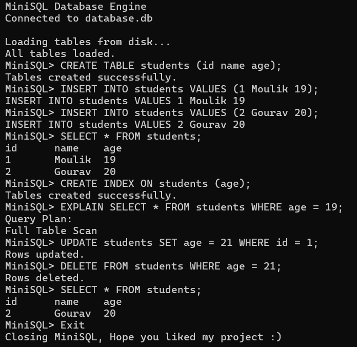

# MiniSQL++ – A Lightweight SQL Engine in C++

MiniSQL++ is a lightweight, in-memory relational database engine built from scratch in C++.  
It supports basic SQL operations such as CREATE TABLE, INSERT, and SELECT.

This project was built to understand database internals including:
- Table abstraction
- Relational storage
- Query execution
- Hash-based table lookup
- Command parsing

---

## 🚀 Features (Phase 1)

- CREATE TABLE
- INSERT INTO
- SELECT * FROM
- Multiple tables supported
- In-memory relational storage
- Hash-based table lookup using `std::unordered_map`

- ### Phase 3 Features
- Hash-based indexing
- CREATE INDEX support
- Optimized WHERE queries
- Automatic index updates on INSERT

---

## 🏗 Architecture

```
MiniSQLEngine/
 ├── main.cpp        → Entry point
 ├── engine.*        → Query execution logic
 ├── parser.*        → Command parsing
 ├── database.*      → Database container
 ├── table.*         → Table abstraction
```

---

## 🧠 Internal Design

- Tables stored using `unordered_map<string, Table>`
- Each table contains:
  - Column metadata
  - Vector of rows
- Each row stores vector<string> values
- O(1) average lookup for tables via hash map

---

## 🖥 Example Usage

```
CREATE TABLE students id name age
INSERT INTO students 1 Moulik 19
INSERT INTO students 2 Aryan 20
SELECT * FROM students
```

Output:

```
id      name    age
1       Moulik  19
2       Aryan   20
```

---

## 🛠 How to Build

Using g++:

```
g++ main.cpp table.cpp database.cpp parser.cpp engine.cpp -o minisql
./minisql
```

---

## 📈 Roadmap

Phase 2:
- WHERE clause
- Column selection
- Improved SQL syntax

Phase 3:
- Hash indexing
- File persistence

Phase 4:
- JOIN operations
- Query optimization

---

## 🎯 Purpose

This project was developed to explore:
- Database system fundamentals
- Relational algebra concepts
- Hash-based indexing
- Query parsing and execution design

---

## 👨‍💻 Author

Moulik Choudhary  
B.Tech CSE | Chandigarh University  
Interested in systems programming, databases, and automation.

## Demo


